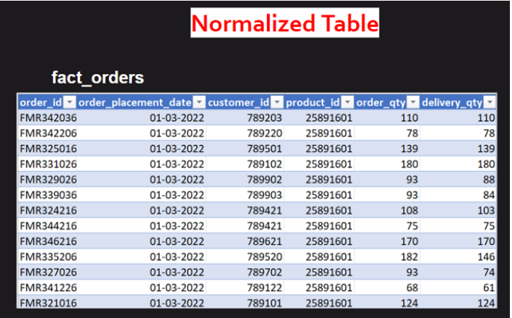

# Week 1 - Task

##  Task 1 - Data Cleaning:

1. Check for duplicates in the dataset and remove them.
 
&rarr; I have used Excel to remove duplicates.

select Data > ***Data*** Tab > ***Remove Duplicate*** option > choose ***Select All*** > then click on ***OK***

2. Standardize the date values to the format YYYY-MM-DD and extract the month name and day type from them.

 
&rarr; Select date column > right click on it > Format cells > select Date type with Standardize form

3. Remove any extra characters, such as special characters, from the employee ID values. Some IDs may contain a '@' character at the end, which can be cleaned and brought to a common format.

 
&rarr; I have used `SUBSTITUTE()` function to remove "@" from text. 

4. Standardize the capitalization of names. Convert all names to title case, which 
means capitalizing the first letter of each word.
5. Map the corresponding values in the status column with the given 
abbreviations:

+ Work From Office --> WFO
+ Work From Home --> WFH
+ Birthday Leave --> BL
+ Menstrual Leave --> ML
+ Paid Leave --> PL
+ Sick Leave --> SL
+ Weekly Off --> WO

 
&rarr; Using Power Query: 

First convert data into Table (select data > press **Ctrl + T** > click on **OK**) > go to Data > ***From Table/Range*** > select status column and then go to ***Transform*** tab > ***Replace Value*** option.

After Data cleaning, updated dataset is [here](./task-1/attendance_data.csv).

## Ad-Hoc Analysis:

Check out the task details [Here](./task-1/HR-email-Task.pdf) 

I have used SQL and Power BI as well to generate report and validate ad-hoc analysis.

+ Using SQL:
  
    &rarr; SQL querries are [here](./task-1/ad-hoc-analysis-solution.sql)

+ Using Power BI (for Question 3 and 4):
      
    &rarr; DAX:
    + Total wfh = CALCULATE(COUNT('atliq_vi attendance'[status]), 'atliq_vi attendance'[status] = "WFH")
    + total wfo = CALCULATE(COUNT('atliq_vi attendance'[status]), 'atliq_vi attendance'[status] = "WFO")
    + wfh% = DIVIDE([Total wfh], [Total Present days],0)
    + Total Present days = [Total wfh] + [total wfo]
    + Total working days = CALCULATE(COUNT('atliq_vi attendance'[status]), 'atliq_vi attendance'[status] <> "WO")
    + Attendance% = DIVIDE([Total Present days],[Total working days],0)

    Check out PBI file [here](./task-1/task1-Q3-and-Q4.pbix)

    ## Task 2 -  Data Normalization

    Check out the Task details [here](./task-2/Data%20Normalization%20Task.pdf)

    Denormalized dataset is available [here](./task-2/fact_order_lines.csv)

    
Denormalized Table Preview

    

      
    &rarr; I am doing normalization using Excel.

    + Steps:
        + First create 4 another sheets (fact_orders, dim_customers, dim_poducts, dim_date)
        + In fact_orders sheet, paste data from main sheet and delete irrelevant columns as per output preview.
        + Then extract unique customer_id fom main sheet using UNIQUE() function and paste as value in dim_customer sheet and named column as "customer_id".
        + After that extract customer name and city in dim_customer table using INDEX and MATCH function from main sheet.
        + The above same steps are followed for dim_date and dim_products as per output preview mentioned below.

    After norrmalization, [here](./task-2/fact_order_lines-normalized.xlsx) you can see normalized output file.     

    
Normalized Fact Table Preview

    

    
Normalized Dim Tables Preview

    

