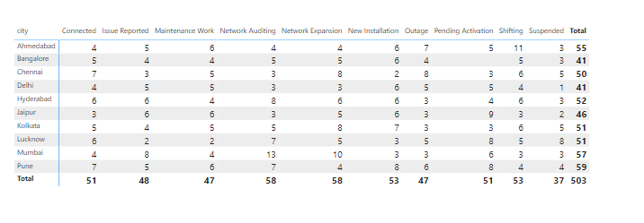

# Week 2 - Task

##  Task 1 - Variance Analysis:

1. **Data Comparison**: Analyze and compare two datasets, *fact_orders.csv* and *benchmarks.csv*, focusing on order quantity and delivery quantity.  

2. **Variance Analysis**: Quantify and identify differences between the actual data (*fact_orders.csv*) and the benchmark data (*benchmarks.csv*).  

Vaiance is calculated as (benchmarrk - actual) and taken it absolute value. Variance % = (benchmark - actual)/ benchmark

3. **Objective**: Highlight variations and insights to assess performance and identify potential areas for improvement.

> Click [Here](./task-1/Variance%20Analysis%20Task.pdf) to view detail task and requirements.

### Tools & Technique:

For this task I have used Power BI.

+ First, I have imported dataset into Power BI.
+ Then after reviewing dataset and requirements, i have created one dimension date table using Power Query to connect benchmark and actual table date wise.
+ Next, I have built Data Model and make relationship.

    Here the Data Model looks like:

    

+ And created Dax query for variance (difference) and variance% and then creted 2 tables for order qty and delivery qty.

    Here all DAX query i have written to solve this task:

    + total order qty = SUM(fact_orders[order_qty])
    + total order qty BM = SUM(benchmarks[total_order_quantity]) 
    + order qty diff = ABS([total order qty BM] - [total order qty])
    + order qty diff % = DIVIDE([order qty diff], [total order qty BM],0)
    + delivery qty = SUM(fact_orders[delivery_qty])
    + total delivery qty BM = SUM(benchmarks[total_delivery_quantity])
    + delivery qty diff = ABS([total delivery qty BM] - [delivery qty])
    + delivery qty diff % = DIVIDE([delivery qty diff], [total delivery qty BM],0)

### Result:

 
Order Qty Variance

Delivery Qty Variance

## Task 2 - SQL Query Debugging:

1. **Load and Review SQL Script**: Import the provided `gdb080.sql` file into MySQL Workbench to set up the database environment.  

2. **Debug SQL Queries**: Identify and fix errors in the queries listed in the `sql_queries.docx` file, ensuring they run correctly against the database.  

3. **Test and Validate**: Thoroughly test each fixed query to confirm accurate functionality and expected results.

> Click [Here](./task-2/SQL%20Query%20Debugging.pdf) to view detail task and requirements.

### Tools & Technique:

I have used for *** MySQL Workbench *** to import dataset and debugging SQL queries to fix it and get correct answers out of it.

> Click [Here](./task-2/sql_queries.pdf) to see the SQL script with errors.

### Result:

Click [Here](./task-2/debugging-solution.sql) to see the corrected SQL queries after debugging.

## Task 3 - Report Automation:

1. **Data Transformation**: Use Power Query to clean, manipulate, and transform the data from *network_data.csv* and *activity_data.csv*.  

2. **Automate Report Creation**: Create a new table in the specified format to replace the manual process, streamlining the client’s weekly report generation.  

3. **Objective**: Save the client's time by automating and optimizing their reporting workflow. 

> Click [Here](./task-3/Report%20Automation.pdf) to view detail task and requirements.

### Tools & Technique:

I have used Power BI to solve this task and automate ETL process using Power Query.

+ First I have imported the datasets in Power Bi and click on transform.
+ Then promote headers of both dataset. It means use 1st row as header.
    + select table > go to Transform tab > choose "Use First Row as Header" option
+ Rename "activity_status" column as "netwok_status" of activity_data table. so that column name for both the tables are same to append rows from one table to another.
+ Then select network_data table > choose Append Queries as New option under Home tab and then select "activity_data" as second table from drop-down like below image:

    

+ After that rename the new table. Right click on old tables and uncheck "enabled load" so that old tables are not loaded. Only new table is loaded. Now, click on Close & Apply option under Home tab.
+ Then, go to Report View and select Matrix visual. Put value like this:
    + Rows: city
    + Column: network_status
    + Value: count (distinct) of network_id

### Result:

## Task 4 - Insights Presentation:

### Presentation:

The task is to analyze the dashboard and provide insights on a ppt that addresses the following questions:

1. What is the impact of the 5G launch on our revenue?
2. Which KPI is underperforming after the 5G launch?
3. After the 5G launch, which plans are performing well in terms of revenue? Which plans are not performing well?
4. Is there any plan affected largely by the 5G launch? Should we continue or discontinue that plan?
5. Is there any plan that is discontinued after the 5G launch? What is the reason for it?

> Click [Here](./task-4/Insights-Presentation-task-mail.pdf) to view detail task and requirements.

### Insights & Recommendation:

Click [Here](./task-4/5G_launch_Impact_Analysis.pdf) to see the insights and Recommendation.

