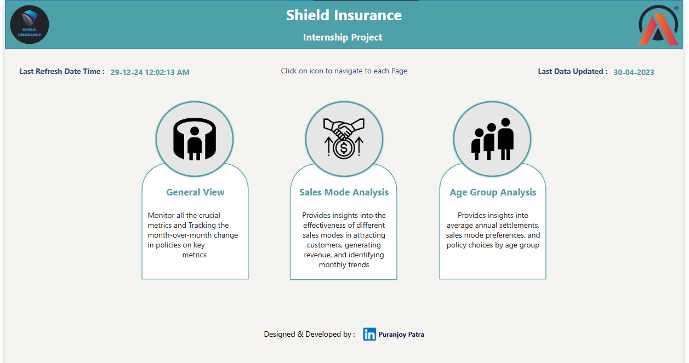
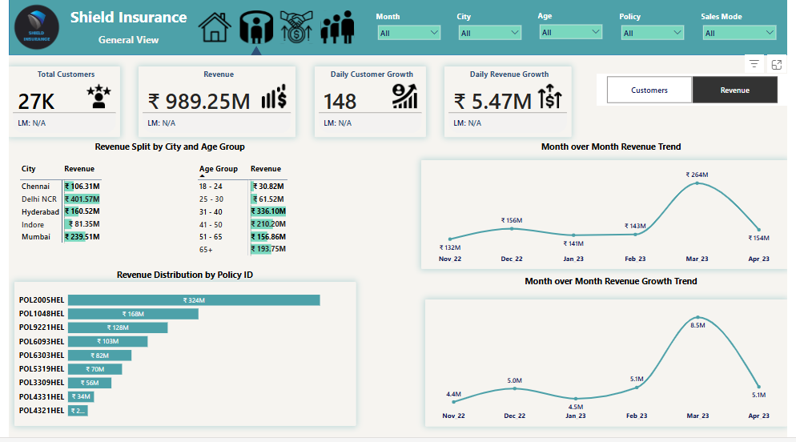
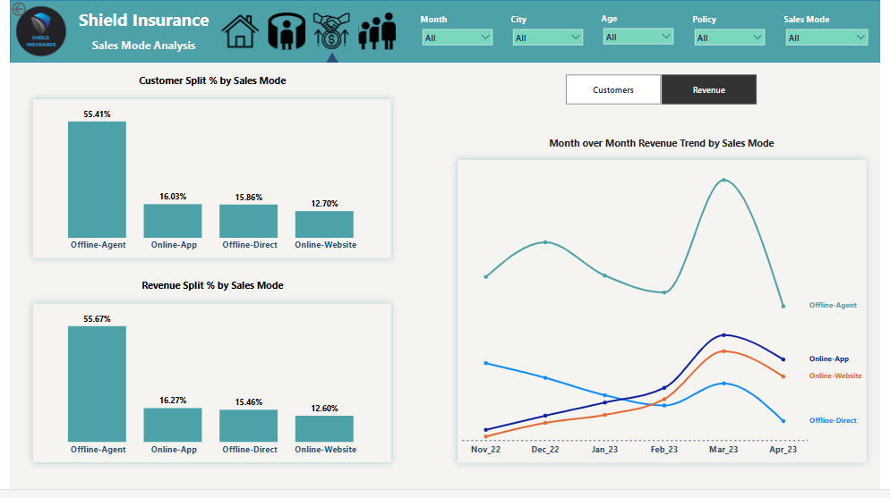
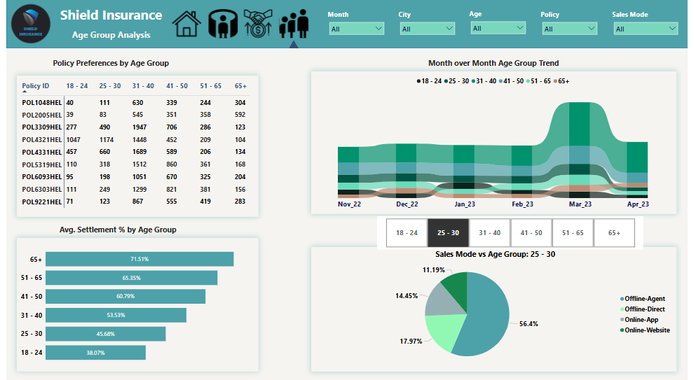

# Provide Insights to Shield Insurance 

## Project Presentation:

## Table of Contents:

- [Company Overview](#company-overview)
- [Problem Statement](#problem-statement)
- [Tools & Technique](#tools--technique)
- [Feature List](#feature-list)
- [Key Metrics](#key-metrics)
- [Dashboard Preview](#dashboard-preview)
- [Live Dashboard Interaction](#live-dashboard-interaction)
- [Insights](#insights)
- [Recommendations](#recommendations)

##  Company Overview:

Shield Insurance specializes in providing affordable and customizable insurance policies tailored to individuals across all age groups. With a strong presence in key cities like Mumbai, Chennai, Delhi, Hyderabad, and Indore.
The company ensures accessibility through diverse sales channels, including offline agents, direct sales, a mobile app, and a website.

## Problem Statement:

Shield Insurance wanted to enhance their decision-making process by leveraging advanced data-driven insights. To assess our capabilities in delivering actionable analytics and supporting their business objectives, they initiated a pilot project as a step toward a potential long-term partnership.

## Tools & Technique:

+ Excel
+ Data Cleaning & Preprocessing
+ Power Query (ETL Process)
+ DAX
+ M Language (Advance Query Editor)
+ Power BI Desktop
+ Power BI Service

## Feature List:

Based on Problem Statement and Client Requirements, I have ceated this below feature list and after validation by client i have proceeded to build dashboard and i have created 3 different pages including home page.

  

## Key Metrics:

+ Total Number of Customers
+ Total Revenue
+ Daily Customer Growth
+ Daily Revenue Growth

## Dashboard Preview:

 
<strong> Home Page </strrong>

  

 

 

<strong> General View </strong>

 Monitor all the crucial metrics and Tracking the month-over-month change in policies on key metrics 
 

  

 

 

<strong> Sales Mode Analysis </strong>

 Provides insights into the effectiveness of different sales modes in attracting customers, generating revenue, and identifying monthly trends

  

 

 

<strong> Age Group Analysis </strong>

 Provides insights into average annual settlements, sales mode preferences, and policy choices by age group
 

  

 

## Live Dashboard Interaction:

To interact with the live dashboard, click here 👉🏻 [Live Dashboard](https://app.powerbi.com/view?r=eyJrIjoiOGNmMmI3MTgtNDg4My00NDNhLTk3ZjctMDlhZmVjZTQ0NjA1IiwidCI6ImM2ZTU0OWIzLTVmNDUtNDAzMi1hYWU5LWQ0MjQ0ZGM1YjJjNCJ9) 

## Insights:

- **Revenue Highlights:** March 2023 marked the highest revenue month, while November 2022 had the lowest daily revenue and customer growth.  
- **Regional Insights:** Delhi NCR led in revenue generation, whereas Indore recorded the lowest revenue and customer numbers.  
- **Age Group Dominance:** The 31-40 age group contributed the most revenue and accounted for the largest customer share.  
- **Low Revenue Groups:** Customers aged 18-24 and 25-30 are the lowest among all age groups.  
- **Leading Sales Channel:** Offline agents drove 55.67% of the revenue and attracted 55.41% of the total customer base.  
- **Best-Selling Policy:** Policy ID POL2005HEL generated the highest revenue, despite being owned by just 7.3% of customers.  
- **Underperforming Policies:** Policies POL4321HEL and POL4331HEL accounted for 30.47% of customers but contributed only 5.9% of revenue.  
- **Claims Patterns:** Customers aged 65+ had the highest claim settlement amounts, while those aged 18-30 had the lowest. 

## Recommendations:

- **Improve Regional Performance:** Identify and address specific challenges in Indore, and launch localized marketing campaigns to drive revenue and customer growth.  
- **Tap into Delhi NCR:** Build on Delhi NCR’s success by designing insurance plans tailored to attract younger and older age groups.  
- **Engage Younger Audiences:** Investigate the low interest among 18-30 age groups and create affordable, personalized policies to meet their needs.  
- **Strengthen Online Channels:** Focus on enhancing the website and running digital marketing campaigns to attract more online customers.  
- **Capitalize on Top Policies:** Increase promotion of high-revenue policies like POL2005HEL to further boost sales and customer acquisition. 

